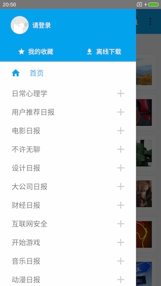

# ZhiHuDaily-React-Native

The is a [Zhihu Daily](http://daily.zhihu.com/) App client, implemented using [**React Native**](http://facebook.github.io/react-native/) for Android. The is a demo project to show how to develop a compelet app with React Native. (The data api is from [ZhihuDailyPurify](https://github.com/izzyleung/ZhihuDailyPurify/wiki/%E7%9F%A5%E4%B9%8E%E6%97%A5%E6%8A%A5-API-%E5%88%86%E6%9E%90))

## How does it look like?

* The home page

* The drawer

* The content page

## How to run

1. Prepare your environment: [Requirements](http://facebook.github.io/react-native/docs/getting-started.html#requirements) and [Android Setup](http://facebook.github.io/react-native/docs/android-setup.html)
2. Clone this repo, and goto the project root directory
3. run `npm install`
4. run `react-native run-android`
5. Enjoy

## Related content

In this project, I used most of technology in React Native:

* Flex Style
* Direct Manipulation
* Native UI Components
* DrawerLayoutAndroid
* Image/Text/ListView
* TouchableHighlight/TouchableNativeFeedback
* ToolbarAndroid/Navigator
* StyleSheet/ToastAndroid/BackAndroid
* Timers
* AsyncStorage
* Animations
* ...

## TODO

1. ~~Add local storage to cache data~~ (done)
2. Add List header banner (Like ViewPager?)
3. ~~Add splash animation~~ (done)
4. ~~Add swipe/pull to refresh~~ (done)
5. Working on incomplete features
6. **iOS compatible**

## License

This project is available under the MIT license.
